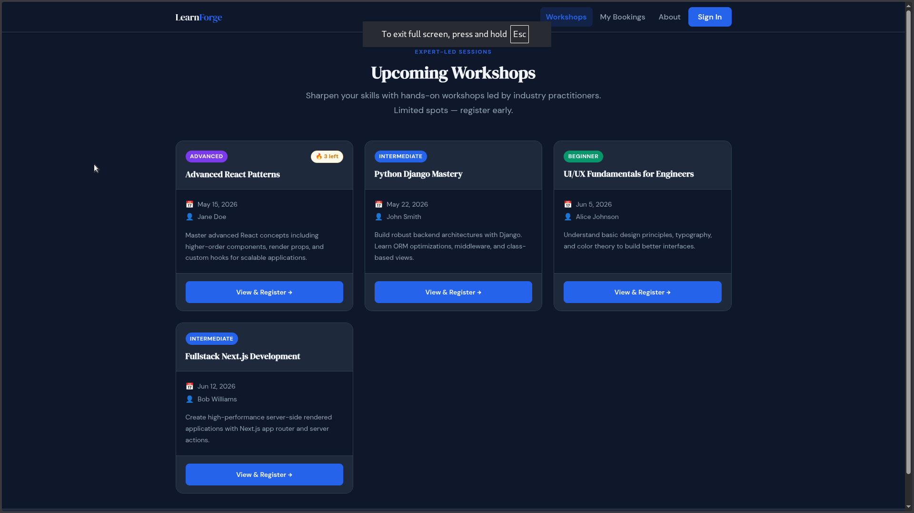
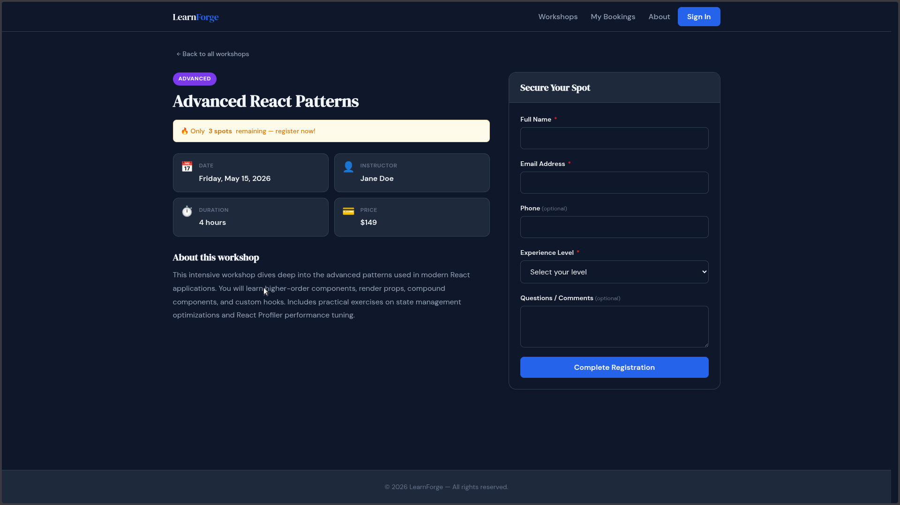
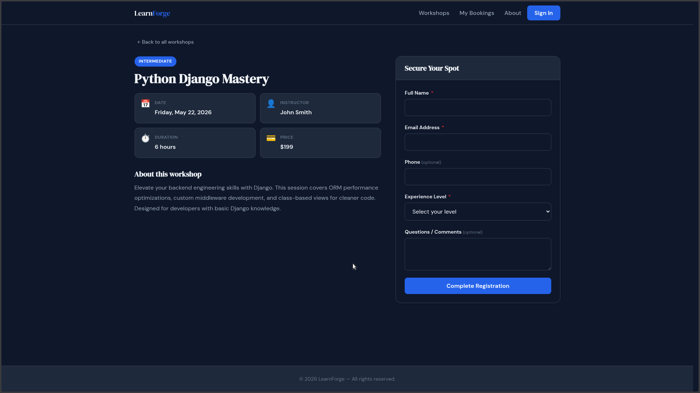
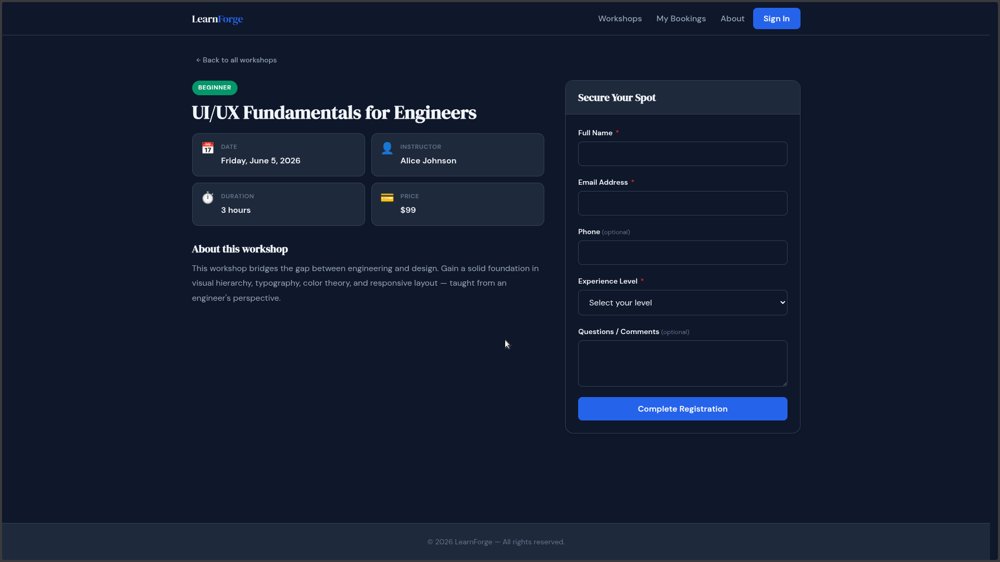
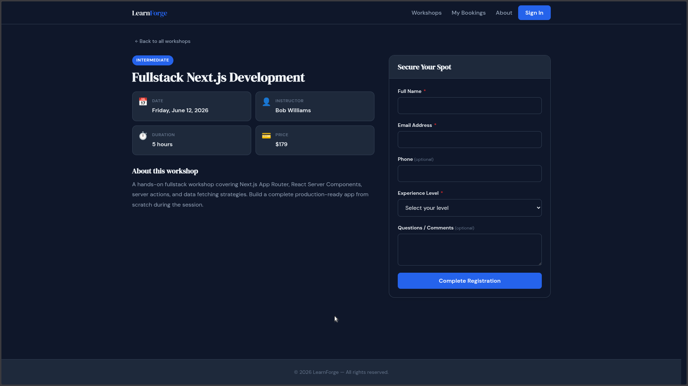
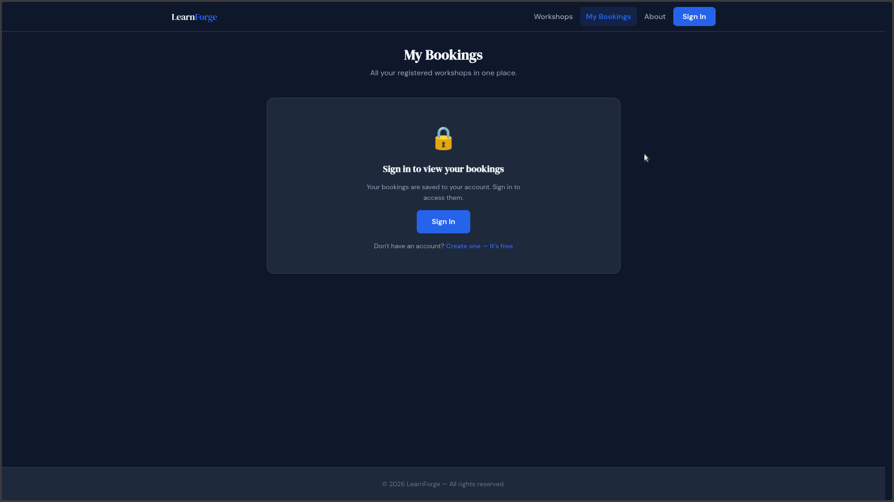
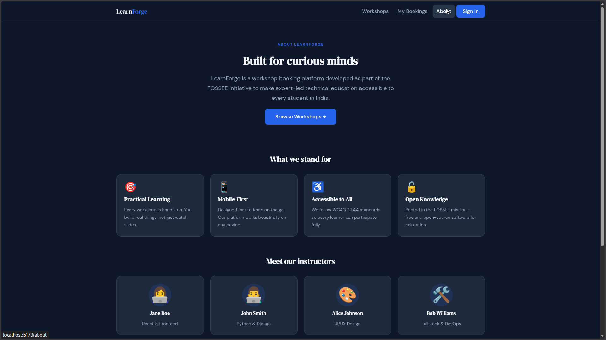
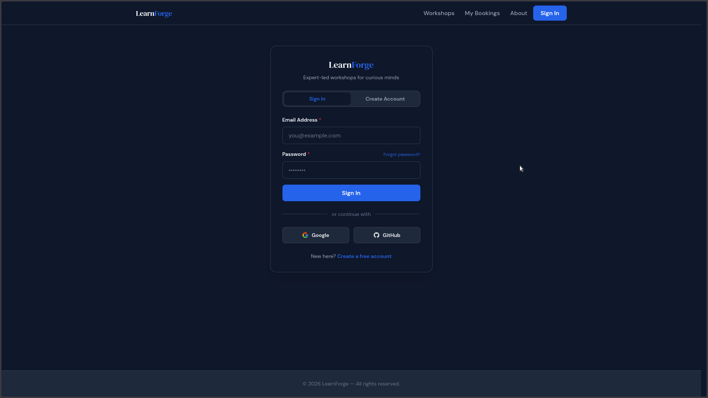
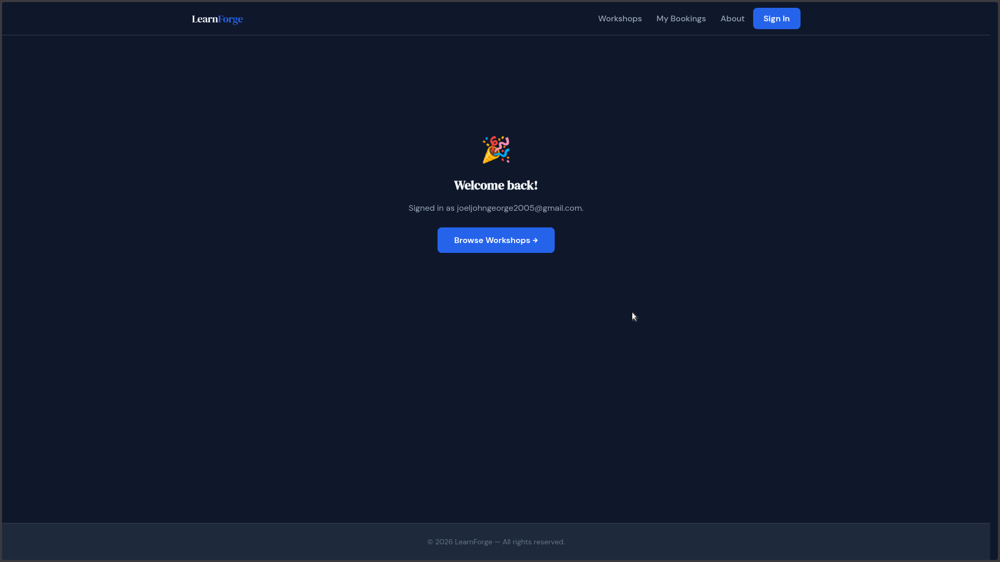

# LearnForge — Workshop Booking UI/UX Enhancement

This is my submission for the FOSSEE Python Screening Task. The goal was to take the existing workshop booking site and improve its design, usability, and mobile experience.

I rebuilt the frontend in React and focused on three things: making it work well on phones, making it accessible for everyone, and keeping the design clean without overcomplicating it.

---

## What Changed (Before → After)

The original site had a basic layout that wasn't really usable on mobile — navigation was awkward, cards didn't reflow properly, and the form had no real-time feedback.

Here's what I improved:

| Area | What I Did |
|------|------------|
| **Layout** | Redesigned the card grid to flow from 1 column on mobile → 2 on tablet → 3 on desktop, using only CSS grid |
| **Navigation** | Added a hamburger menu for mobile with close-on-Escape and close-on-outside-click |
| **Typography** | Switched to DM Sans + DM Serif Display for better readability at small sizes |
| **Forms** | Added per-field validation on blur, inline error messages, a loading spinner on submit, and a success confirmation screen |
| **Visual hierarchy** | Used eyebrow text, muted subtitles, and level badges (color-coded by difficulty) so users can scan workshops quickly |
| **Urgency cues** | "🔥 X spots left" on cards + sold-out disabled state |
| **Dark mode** | Automatic via `prefers-color-scheme`, no toggle needed |
| **Accessibility** | Skip-to-main link, focus rings, ARIA labels, keyboard nav throughout |
| **Performance** | Route-level code splitting with `React.lazy`, no animation libraries |

---

## Screenshots

Below are comparisons between the original FOSSEE workshop booking UI and the improved version.

---

### 🏠 1. Landing Page (After)


---

### 🎓 2. Advanced Workshop View (After)


---

### 🐍 3. Original Landing (Before)


---

### 🎨 4. UI/UX Improvements (After)


---

### 💻 5. Full Stack Page (After)


---

### 📚 6. Booking Page (Before)


---

### ℹ️ 7. About Page (After)


---

### 🔐 8. Sign In (Before)


---

### ✅ 9. Sign In Success (After)


---

## Design Decisions

I followed three simple ideas throughout:

**Start from mobile.** The task brief says most users are on phones, so every layout decision started at 320px and scaled up. I used `clamp()` for font sizes so text scales smoothly without needing a bunch of media queries.

**Show less upfront.** The workshop list only shows what you need to decide whether to click — title, level, date, instructor, and a one-line description. Everything else (full description, registration form) is on the detail page. Less clutter on the first screen.

**Accessibility isn't optional.** Every button and link has a visible focus ring. The hamburger menu closes on Escape and returns focus to the button. Form errors are announced to screen readers with `role="alert"`. I tried to follow WCAG 2.1 AA throughout.

---

## Responsiveness

- **CSS Grid with `auto-fill`** handles the card layout — no JavaScript, no breakpoint hacks
- **`clamp()` on headings** so typography scales fluidly between mobile and desktop
- **Sticky navbar** using `position: sticky` — stays visible on long pages without JS scroll listeners
- **48×48px touch targets** on all buttons and links (WCAG minimum)
- **Hamburger menu** appears on screens below 768px, with a slide-in animation

I tested on Chrome DevTools (iPhone SE, Pixel 5, iPad) and on my actual phone.

---

## Trade-offs

| What I chose | Why |
|--------------|-----|
| CSS Modules over Tailwind | Slightly more CSS to write, but zero runtime cost and no class name collisions. Felt cleaner for this scale. |
| Google Fonts via `<link>` | Adds one external request, but `font-display: swap` + `preconnect` keeps it from blocking the page |
| Mock data instead of a real API | Keeps the scope focused on UI/UX. Data lives in JS — fine for a prototype |
| CSS transitions only (no Framer Motion / GSAP) | Zero bundle cost for animations. They're all disabled automatically if the user prefers reduced motion |
| No search/filter on the workshop list | With only 4 workshops it felt unnecessary and would have been overengineering. I'd add it if the list grew |

---

## Challenges

The hardest bug was a **stale closure in the form validation hook**.

`handleChange` was created with `useCallback` and closed over `values` at the time it was created. When a user typed quickly, validation ran against an old snapshot of the form state — so errors would flicker or not show up at all.

The fix:
1. Use `setValues(prev => ...)` (functional updater) so the update always runs against the latest state
2. Store `validate` and `values` in a `useRef` that gets updated every render — refs are always current, unlike closure variables
3. Keep `handleChange` / `handleBlur` / `handleSubmit` with an empty dependency array so they're created once and don't cause unnecessary child re-renders

It's a common React pitfall but it took me a while to figure out why the form "felt broken" under fast input.

---

## Features

- Responsive card grid (1 → 2 → 3 columns)
- Mobile hamburger nav with Escape-to-close
- Per-field form validation with inline errors
- Loading spinner + success confirmation on registration
- "Spots left" urgency indicator + sold-out state
- Dark mode (automatic, based on system preference)
- Reduced motion support
- Skip-to-main-content link
- Focus ring on all interactive elements
- Route-level code splitting
- 404 page
- Toast notification system
- Error boundary for graceful crash recovery

---

## Tech Stack

- **React 18** with React Router
- **Vite** for dev server and build
- **CSS Modules** for scoped styles
- **CSS custom properties** for the design token system (colors, spacing, typography)
- **Nginx** for production serving (via Docker)

---

## How to Run

### Local dev server

```bash
git clone https://github.com/joeljohngeorge8080/fossee-uiux-workshop-booking.git
cd fossee-uiux-workshop-booking/frontend
npm install
npm run dev
# → http://localhost:5173
```

### Production build

```bash
cd frontend
npm run build
npm run preview
# → http://localhost:4173
```

### Docker (easiest for reviewers)

```bash
docker compose up --build
# → http://localhost:3000
```

---

## Project Structure

```
fossee-uiux-workshop-booking/
├── frontend/
│   ├── src/
│   │   ├── styles/          # Design tokens, dark mode, global reset
│   │   ├── hooks/           # useFormValidation, useAsync, useDebounce
│   │   ├── components/      # Navbar, WorkshopCard, RegistrationForm, Toast, Layout
│   │   ├── context/         # Workshop data context
│   │   ├── pages/           # WorkshopList, WorkshopDetails, About, MyBookings, SignIn
│   │   ├── api/             # API abstraction layer
│   │   ├── App.jsx
│   │   └── main.jsx
│   ├── index.html           # SEO meta tags, Open Graph, font preloads
│   └── vite.config.js
├── Dockerfile               # Multi-stage build (Node → Nginx Alpine)
├── docker-compose.yml
├── nginx.conf               # SPA routing, gzip, cache headers
├── .github/workflows/
│   ├── ci.yml               # Lint + build on every push
│   └── cd.yml               # Docker build + push on merge to main
└── screenshots/
```

---

## Contact

Submitted for the FOSSEE Python Screening Task — UI/UX Enhancement.
Questions: pythonsupport@fossee.in
